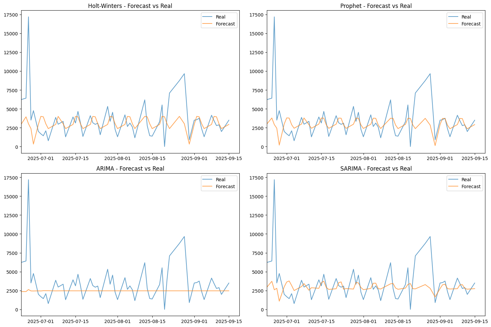

# 📊 Sales Forecast Project

This project demonstrates how to build and evaluate different **time series forecasting models** for sales prediction using Python.

It includes data preprocessing, exploratory analysis, and forecasts with the following models:

- Holt-Winters (Exponential Smoothing)
- Prophet (Facebook/Meta)
- ARIMA
- SARIMA  

The results are visualized and compared using standard forecast accuracy metrics.

---

## 🚀 Project Structure

├── sales.csv            # Example sales dataset (semicolon-separated)    
├── sales_forecast.ipynb # Jupyter Notebook with full workflow  
├── requirements.txt     # Python dependencies  
├── venv_setup.ps1       # Script to create virtual env and install requirements
└── README.md            # Project documentation

---

## ⚙️ Setup Instructions

### 1. Clone the repository
```powershell
git clone <your-repo-url>
cd <project-folder>
```

### 2. Create Virtual Environment
Run the setup script to automatically create a virtual environment and install dependencies from requirements.txt:
```powershell
.\venv_setup.ps1
```
This will create a venv folder inside the project and install all required libraries.

### 3. Open Jupyter Notebook
```powershell
jupyter notebook Sales_Forecast.ipynb
```

---

## 📊 Data

The dataset (sales.csv) should contain at least the following columns:

- Posting Date → renamed to date
- plant → plant identifier (e.g., loc30)
- material → product/material code
- quantity → sales quantity

The preprocessing step includes:

- Converting date formats
- Normalizing numeric fields
- Removing negative and zero quantities (business rule)
- Resampling to daily frequency and filling missing dates with 0

---

## 🔮 Forecasting Models

The notebook implements and compares four models:

- Holt-Winters (additive seasonal component, weekly seasonality)
- Prophet (Facebook’s time series model with weekly seasonality enabled)
- ARIMA (non-seasonal Auto ARIMA)
- SARIMA (seasonal Auto ARIMA with m=7)

---

## 📈 Evaluation

The models are evaluated using the following metrics:
- MSE (Mean Squared Error)
- MAE (Mean Absolute Error)
- MAPE (Mean Absolute Percentage Error)

--- 

✅ Example Output

At the end of the notebook, you will see:

Line plots comparing forecasts with actual sales.



A metrics summary table like:

| Model         | MSE           | MAE       | MAPE   |
|---------------|---------------|-----------|--------|
| Holt-Winters  | 7,055,814.6   | 1,608.8   | 86.6%  |
| Prophet       | 7,135,732.3   | 1,579.4   | 82.1%  |
| ARIMA         | 7,944,247.9   | 1,737.2   | 54.4%  |
| SARIMA        | 7,362,742.7   | 1,625.4   | 75.4%  |

---

## 🎯 Conclusion

The **SARIMA** model generates forecasts closer to the central trend, ignoring extreme peaks.

High MAPE in **Holt-Winters** and **Prophet** is expected due to the series with many zeros.

**ARIMA** has a lower percentage error, but its MSE is high, reflecting difficulty in capturing high peaks.

In series with zeros and high volatility, it is common for smoothed forecasts to fail to replicate extremes, but they are still useful for average demand planning.

---

## 💻 Requirements

Main dependencies (installed via requirements.txt):

- pandas
- numpy
- matplotlib
- seaborn
- scikit-learn
- statsmodels
- prophet
- pmdarima
- jupyter

---
👤 Author: Marco Rocha

📅 Python Version: 3.11.9
